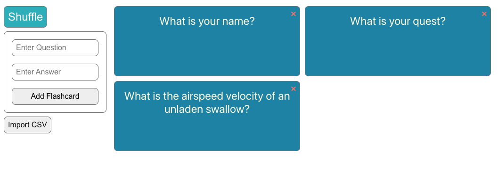

# React Flashcard App

I developed this app to help me study for the AWS Certification exams. There are hundreds of AWS
services to memorize, and I wanted flashcards to help me study. I also wanted more practice with
React, so this was a perfect project to kill two birds with one stone.

This project was bootstrapped with [Create React App](https://github.com/facebook/create-react-app)
and based on a [a project by Dev.to](https://dev.to/drew_womble/create-a-flashcard-application-using-react-53ij)
with some modifications that allow the user to import a CSV, shuffle the cards, and remove ones
they've already memorized.

Flashcard data is persisted in a json-based data store for ease of testing, but the app can be
easily modified to use a database if you want to deploy it to a server.

I hope you find it useful!

## Available Scripts

In the project directory, you can run:

### `npm install`
### `npm run server`
### `npm start`

Runs the json-server (data store) and the app in the development mode.\
Open [http://localhost:3000](http://localhost:3000) to view it in your browser.

The page will reload when you make changes.\
You may also see any lint errors in the console.

### `npm test`

Launches the test runner in the interactive watch mode.\
See the section about [running tests](https://facebook.github.io/create-react-app/docs/running-tests) for more information.

### `npm run build`

Builds the app for production to the `build` folder.\
It correctly bundles React in production mode and optimizes the build for the best performance.

The build is minified and the filenames include the hashes.\
Your app is ready to be deployed!
